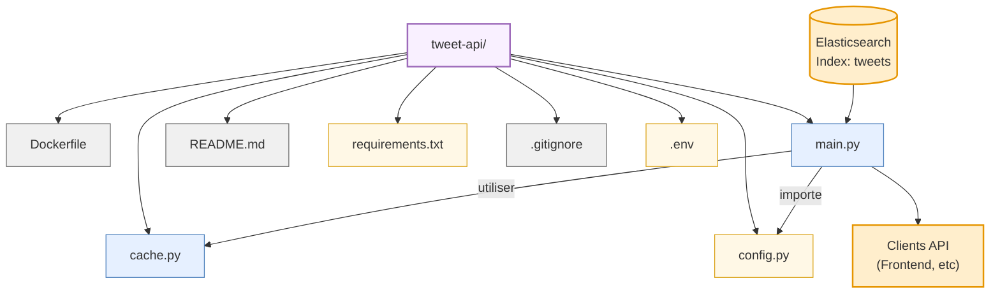

# Structure du Composant Tweet API

Ce composant est une API REST basée sur FastAPI qui expose les tweets traités stockés dans Elasticsearch.

## Description des fichiers principaux

### Configuration et Utilitaires
- **config.py**: Configuration de l'API (connexion à Elasticsearch, paramètres API)
- **cache.py**: Implémentation facultative de mise en cache pour améliorer les performances
- **requirements.txt**: Dépendances Python du service

### Code principal
- **main.py**: Point d'entrée de l'API FastAPI, définit tous les endpoints et la logique

## Endpoints de l'API

L'API expose plusieurs endpoints pour accéder aux données des tweets:

- **`/`**: Healthcheck et informations sur l'API
- **`/tweets`**: Liste de tweets avec filtrage et pagination
  - Paramètres: q (recherche), hashtag, sentiment, region, limit, offset
- **`/tweets/{id}`**: Récupère un tweet spécifique par ID
- **`/trends`**: Obtient les hashtags tendance
  - Paramètres: limit, q (filtre), sentiment
- **`/regions`**: Distribution géographique des tweets
- **`/sentiment`**: Résumé de l'analyse de sentiment
- **`/map-data`**: Données géographiques pour visualisation sur carte
  - Paramètres: sentiment, hashtag, limit

## Modèles de données

L'API utilise Pydantic pour valider et documenter les modèles de données:
- **Tweet**: Structure complète d'un tweet traité
- **TweetResponse**: Liste paginée de tweets
- **TrendingHashtag** et **TrendsResponse**: Hashtags tendance
- **RegionCount** et **RegionsResponse**: Distribution par région
- **SentimentSummary**: Distribution des sentiments
