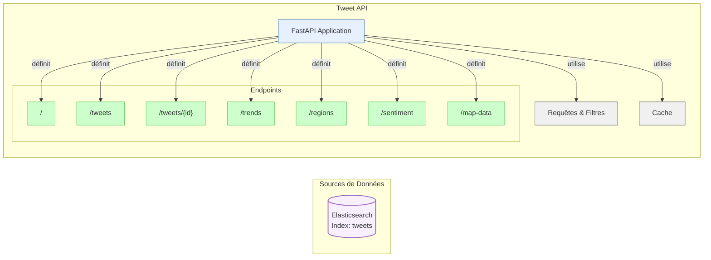

# Flux de Fonctionnement du Tweet API

Ce document décrit le flux de données et le fonctionnement du composant Tweet API.

## Diagramme de Flux

## Description du Fonctionnement

1. **Configuration et Initialisation**:
   - Charge les paramètres de configuration (Elasticsearch, CORS, mise en cache)
   - Établit la connexion à Elasticsearch
   - Initialise l'application FastAPI avec documentation Swagger/OpenAPI

2. **Endpoints Principaux**:

   - **`/`** (Healthcheck):
     - Vérifie que l'API est opérationnelle
     - Fournit des informations de base sur le service

   - **`/tweets`**:
     - Récupère une liste paginée de tweets
     - Prend en charge le filtrage par texte, hashtag, sentiment, région
     - Supporte la pagination avec paramètres `limit` et `offset`

   - **`/tweets/{id}`**:
     - Récupère un tweet spécifique par son identifiant
     - Retourne une erreur 404 si le tweet n'existe pas

   - **`/trends`**:
     - Effectue des agrégations sur les hashtags
     - Retourne les hashtags les plus populaires
     - Permet de filtrer par sentiment ou texte

   - **`/regions`**:
     - Agrège les tweets par région géographique
     - Fournit la distribution géographique des tweets

   - **`/sentiment`**:
     - Calcule la répartition des sentiments
     - Retourne les comptages de tweets positifs, négatifs et neutres

   - **`/map-data`**:
     - Récupère les données géographiques pour visualisation sur carte
     - Filtre par sentiment ou hashtag
     - Optimisé pour les visualisations spatiales

3. **Traitement des Requêtes**:
   - Utilise le client Elasticsearch pour exécuter des requêtes DSL
   - Transforme les résultats en modèles Pydantic pour validation
   - Met en cache les résultats fréquemment demandés (si activé)
   - Gère les erreurs et exceptions avec des réponses HTTP appropriées

4. **Réponses**:
   - Retourne les données au format JSON structuré
   - Inclut des métadonnées comme le nombre total de résultats
   - Utilise les modèles Pydantic pour garantir la cohérence des réponses

Cette API sert de couche intermédiaire entre le stockage de données (Elasticsearch) et les applications clientes, offrant une interface RESTful pour accéder aux tweets traités et à leurs analyses.
