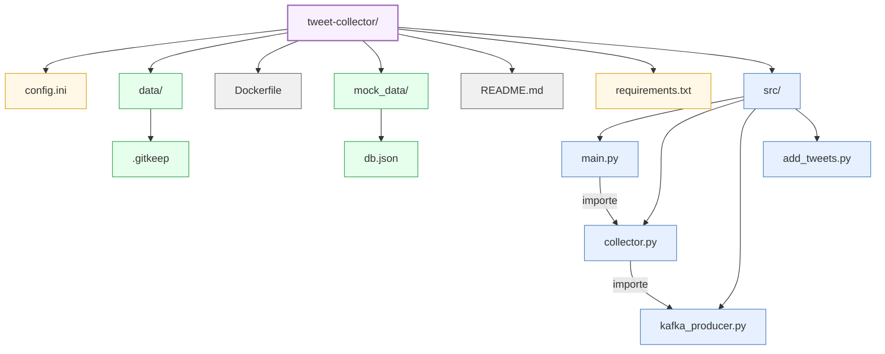

# Structure du Composant Tweet Collector

Ce composant est responsable de la collecte des tweets depuis une source de données (JSON Server) et leur envoi vers Kafka.

## Description des fichiers principaux

### Configuration
- **config.ini**: Configuration du collecteur (URLs, identifiants, paramètres)
- **requirements.txt**: Dépendances Python du service

### Code source (src/)
- **main.py**: Point d'entrée du service, initialise et lance le collecteur
- **collector.py**: Classe principale qui récupère et filtre les tweets
- **kafka_producer.py**: Gère la connexion à Kafka et l'envoi des messages
- **add_tweets.py**: Utilitaire pour ajouter des tweets factices à la base de données

### Données
- **mock_data/db.json**: Données JSON simulées pour le développement
- **data/**: Répertoire pour stocker des données temporaires/locales

## Flux d'exécution
1. **main.py** initialise une instance de `TweetCollector`
2. Le collecteur se connecte à la source de données (JSON Server)
3. Le collecteur récupère les tweets et les filtre (nouveaux uniquement)
4. Les tweets sont envoyés vers Kafka via le `TweetKafkaProducer`
5. Le processus se répète à intervalles réguliers
