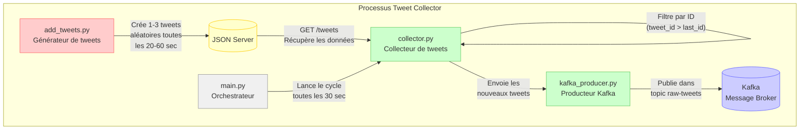

# Flux de Fonctionnement du Tweet Collector

Ce document décrit le flux de données et le fonctionnement du composant Tweet Collector.

## Diagramme de Flux

## Description du Fonctionnement

1. **Génération des Données** (`add_tweets.py`):
   - Génère de nouveaux tweets factices (1 à 3 à la fois)
   - Ajoute ces tweets à la base de données JSON Server
   - Fonctionne à intervalles aléatoires (20 à 60 secondes)

2. **Orchestration** (`main.py`):
   - Point d'entrée du service
   - Initialise le collecteur de tweets
   - Déclenche le processus de collecte à intervalles réguliers (30 secondes)

3. **Collecte** (`collector.py`):
   - Se connecte au JSON Server via HTTP
   - Récupère la liste complète des tweets
   - Filtre uniquement les nouveaux tweets (IDs supérieurs au dernier tweet traité)
   - Transmet les nouveaux tweets au producteur Kafka

4. **Production vers Kafka** (`kafka_producer.py`):
   - Connecte le service au broker Kafka
   - Sérialise les tweets au format JSON
   - Publie les messages dans le topic `raw-tweets`
   - Confirme l'envoi réussi des messages

Ce processus permet de simuler un flux continu de nouveaux tweets pour le développement et les tests, tout en assurant que seuls les nouveaux tweets sont transmis au système de traitement en aval.
