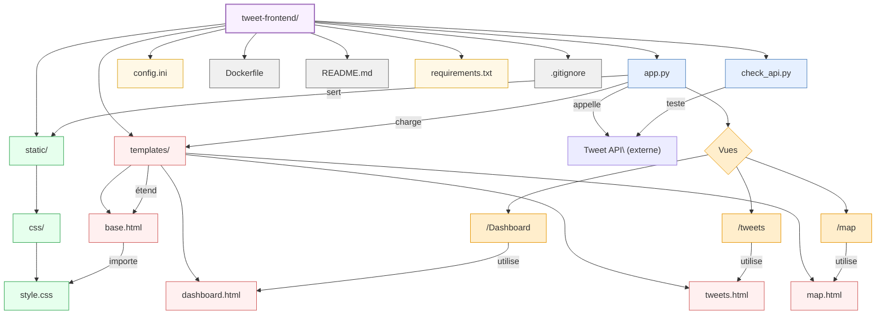

# Structure du Composant Tweet Frontend

Ce composant est l'interface utilisateur de l'application, développée avec Flask et des librairies JavaScript pour la visualisation.

## Description des fichiers principaux

### Application
- **app.py**: Point d'entrée de l'application Flask, définit les routes et la logique
- **check_api.py**: Outil de diagnostic pour vérifier la connexion à l'API
- **config.ini**: Configuration du frontend (URL de l'API, paramètres Flask)
- **requirements.txt**: Dépendances Python du service

### Interface utilisateur
- **static/**: Fichiers statiques servis directement
  - **css/style.css**: Styles personnalisés pour l'application

- **templates/**: Templates Jinja2 pour les vues HTML
  - **base.html**: Template de base avec structure commune (header, footer, navbar)
  - **dashboard.html**: Vue principale avec tableaux de bord et graphiques
  - **tweets.html**: Interface de navigation des tweets avec filtres
  - **map.html**: Visualisation géographique des tweets sur une carte

## Vues principales

1. **Dashboard** ('/')
   - Graphiques de tendances des hashtags
   - Distribution des sentiments
   - Répartition géographique
   - Tableaux de données résumées

2. **Tweets** ('/tweets')
   - Liste paginée des tweets
   - Filtrage par texte, hashtag, sentiment
   - Affichage détaillé des tweets et métadonnées

3. **Map** ('/map')
   - Carte interactive avec les emplacements des tweets
   - Filtrage par sentiment et hashtag
   - Visualisation par couleur selon le sentiment

4. **Proxies API** ('/api/*')
   - Endpoints qui relaient les requêtes à l'API principale
   - Évite les problèmes de CORS depuis le navigateur

## Technologies frontend

- **Bootstrap 5**: Framework CSS pour l'interface responsive
- **Chart.js**: Visualisations graphiques des données
- **Leaflet.js**: Cartes interactives pour la géolocalisation
