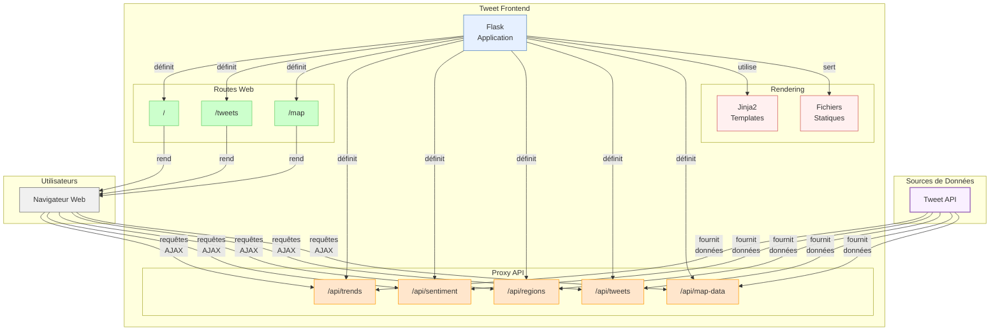

# Flux de Fonctionnement du Tweet Frontend

Ce document décrit le flux de données et le fonctionnement du composant Tweet Frontend.

## Diagramme de Flux

## Description du Fonctionnement

1. **Initialisation de l'Application**:
   - Configure l'application Flask
   - Charge les paramètres d'environnement (URL de l'API, etc.)
   - Définit les routes et les filtres de template

2. **Routes Principales**:

   - **`/`** (Dashboard):
     - Affiche la page principale avec visualisations et statistiques
     - Utilise le template `dashboard.html`
     - Charge les données via JavaScript/AJAX depuis les endpoints proxy

   - **`/tweets`**:
     - Interface de navigation et recherche des tweets
     - Utilise le template `tweets.html`
     - Permet le filtrage et la pagination

   - **`/map`**:
     - Visualisation géographique des tweets sur une carte
     - Utilise le template `map.html` et Leaflet.js
     - Permet le filtrage par sentiment et hashtag

3. **Proxy API**:
   - **`/api/trends`**: Relais pour les hashtags tendance
   - **`/api/sentiment`**: Relais pour les données de sentiment
   - **`/api/regions`**: Relais pour la distribution géographique
   - **`/api/tweets`**: Relais pour la recherche de tweets
   - **`/api/map-data`**: Relais pour les données cartographiques

   Ces endpoints agissent comme proxy, transférant les requêtes du navigateur vers l'API backend et retournant les réponses. Cela permet d'éviter les problèmes CORS et de simplifier les requêtes côté client.

4. **Rendu et Interface Utilisateur**:
   - Utilise des templates Jinja2 pour générer le HTML
   - Charge Bootstrap 5 pour le style et la mise en page responsive
   - Utilise Chart.js pour les graphiques et visualisations
   - Utilise Leaflet.js pour les cartes interactives
   - Intègre JavaScript pour les interactions dynamiques:
     - Chargement asynchrone des données
     - Filtrage interactif
     - Mise à jour des visualisations en temps réel

5. **Flux de Données**:
   - L'utilisateur accède à une page via son navigateur
   - Le serveur Flask génère le HTML initial via les templates
   - Le JavaScript côté client effectue des requêtes AJAX vers les endpoints proxy
   - Les endpoints proxy transfèrent ces requêtes vers l'API backend
   - Les données reçues sont utilisées pour mettre à jour dynamiquement l'interface

Cette architecture permet une interface utilisateur réactive tout en maintenant une séparation claire entre le frontend et le backend, facilitant la maintenance et l'évolution de l'application.
