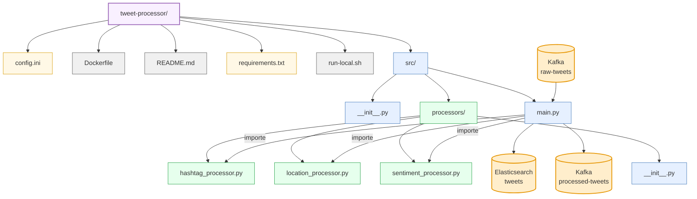

# Structure du Composant Tweet Processor

Ce composant est responsable du traitement et de l'enrichissement des tweets bruts provenant de Kafka, avant de les stocker dans Elasticsearch.

## Description des fichiers principaux

### Configuration
- **config.ini**: Configuration du processeur (connexions Kafka/Elasticsearch, paramètres de traitement)
- **requirements.txt**: Dépendances Python du service
- **run-local.sh**: Script pour exécuter le processeur en environnement local

### Code source (src/)
- **main.py**: Point d'entrée du service, gère la connexion à Kafka et Elasticsearch, et orchestre le processus de traitement
- **processors/**: Modules spécialisés pour le traitement des tweets
  - **hashtag_processor.py**: Extraction et analyse des hashtags
  - **location_processor.py**: Normalisation des données géographiques
  - **sentiment_processor.py**: Analyse de sentiment des textes des tweets

## Traitement des tweets
Le processeur effectue plusieurs transformations sur chaque tweet:

1. **Extraction des hashtags** (hashtag_processor.py):
   - Extraction des hashtags à partir du texte
   - Comptage et calcul de fréquence

2. **Normalisation géographique** (location_processor.py):
   - Validation des coordonnées géographiques
   - Détermination de la région (continent)
   - Formatage pour Elasticsearch (geo_point)

3. **Analyse de sentiment** (sentiment_processor.py):
   - Calcul de la polarité (positive/négative)
   - Calcul de la subjectivité
   - Attribution d'une étiquette (positive/négative/neutre)

Après traitement, les tweets enrichis sont:
- Indexés dans Elasticsearch
- Publiés dans un topic Kafka de sortie
