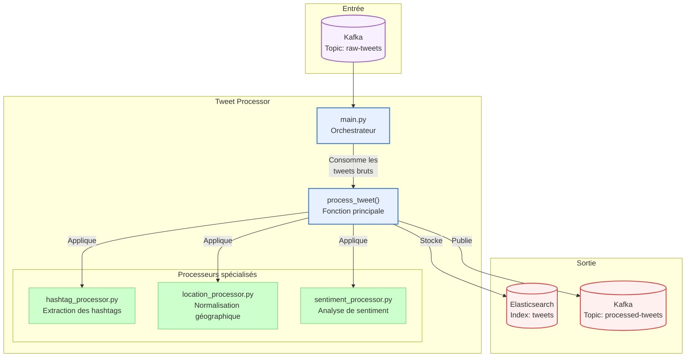

# Flux de Fonctionnement du Tweet Processor

Ce document décrit le flux de données et le fonctionnement du composant Tweet Processor.

## Diagramme de Flux

## Description du Fonctionnement

1. **Consommation des Tweets** (`main.py`):
   - Crée un consommateur Kafka connecté au topic `raw-tweets`
   - Configure la connexion à Elasticsearch
   - Initialise le producteur Kafka pour le topic `processed-tweets`
   - Consomme les messages Kafka en continu

2. **Traitement des Tweets** (`process_tweet()`):
   - Reçoit les tweets bruts depuis Kafka
   - Applique en séquence les différents processeurs spécialisés
   - Ajoute des métadonnées de traitement (horodatage, etc.)

3. **Processeurs Spécialisés**:
   - **Extraction des Hashtags** (`hashtag_processor.py`):
     - Extrait les hashtags du texte du tweet
     - Standardise les hashtags (minuscules)
     - Compte les occurrences et calcule la fréquence

   - **Normalisation Géographique** (`location_processor.py`):
     - Valide et normalise les coordonnées géographiques
     - Détermine la région/continent basée sur les coordonnées
     - Formate les données géographiques pour Elasticsearch (geo_point)

   - **Analyse de Sentiment** (`sentiment_processor.py`):
     - Analyse le texte du tweet pour déterminer la polarité (positif/négatif)
     - Calcule la subjectivité du texte
     - Attribue une étiquette de sentiment (positif, négatif, neutre)

4. **Stockage et Publication**:
   - Indexe les tweets enrichis dans Elasticsearch
   - Publie les tweets traités dans le topic Kafka `processed-tweets`

Ce pipeline de traitement transforme les tweets bruts en données structurées et enrichies, prêtes à être analysées et visualisées. Le traitement est effectué en temps réel, permettant une analyse continue du flux de tweets.
